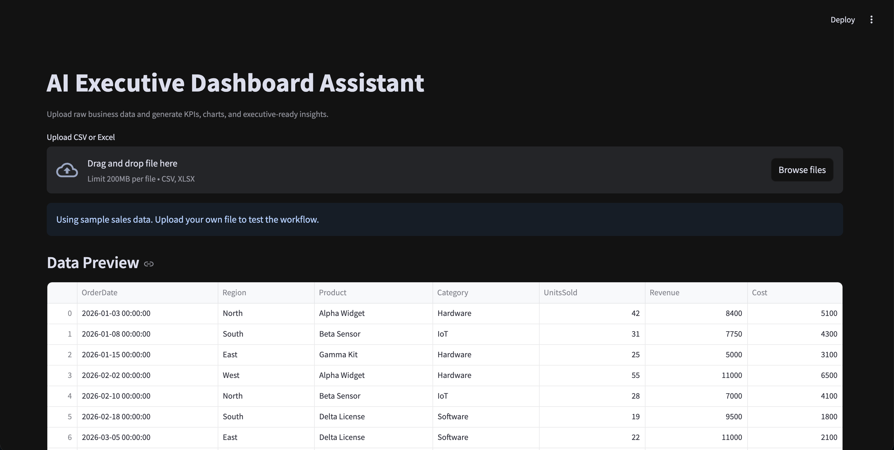
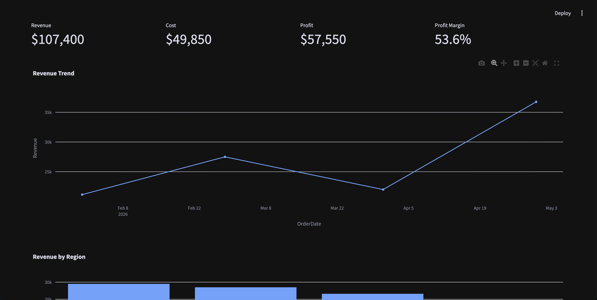
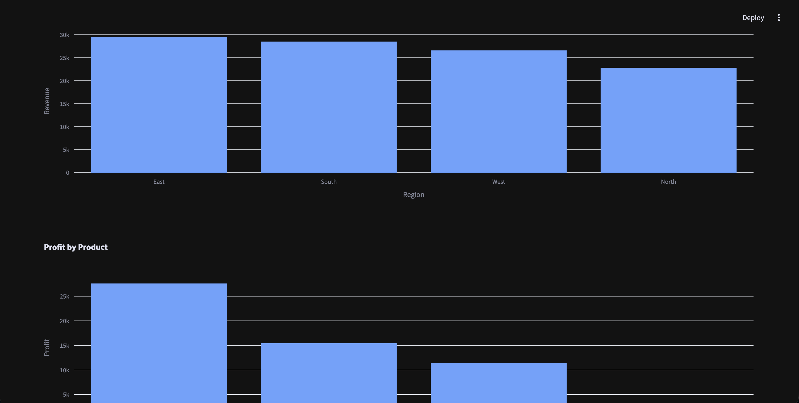

# AI Executive Dashboard Assistant

## Business Problem
Many teams still spend hours cleaning Excel exports, calculating KPIs, building charts, and writing status updates manually.

## Solution
This Streamlit app turns raw business data into an executive dashboard with KPIs, trend charts, product profitability, and AI-style business insights.

## What It Demonstrates
- Data ingestion from CSV/Excel
- Automated data profiling
- KPI generation
- Dashboarding
- Executive summary generation
- Business-focused analytics engineering

## Dashboard Preview








## Run
```bash
pip install -r requirements.txt
streamlit run app.py
```
